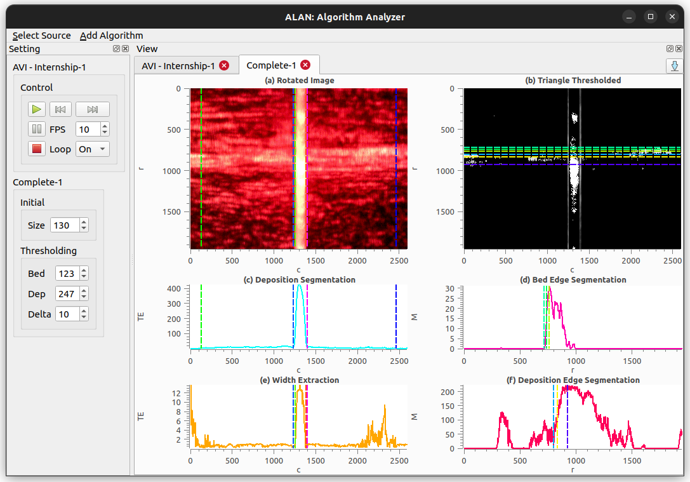

# ALAN: Algorithm Analyzer

**ALAN** is a GUI application for algorithm visuaization. Being able to 
visualize how algorithms behave on recorded videos, while being able to 
interact and change algorithm settings could be helpful in algorithm design.

## Gallery

An example screenshot is displayed below. The screenshot displays
ALAN capturing recorded AVI videos. Many more options are possible and if not 
available, it can easily be extended. 



## Main Features / Comments
Major information:

  - Easy algorithm creation without the need for Qt knowledge
  - Easy GUI widget creation through dedicated list structure i.e no Qt required
  - Qwt plotting integration for fast execution. 
  - Build with Python,Qt, OpenCV and Numpy

## How to get it

Git has to be installed to clone: 
```sh
sudo apt install git
```
Clone the repository to current working directory
```sh
git clone https://github.com/gijsvanhoutum/trec.git
```
We advise to install a new python virtual environment first with:
```sh
python3 -m venv venv
```
Activate environment
```sh
source venv/bin/activate
```
Install all necessary Python packages with:
```sh
pip install -r /trec/requirements.txt
```
## How to run it

To run execute the following from the current working directory:
```sh
python3 /trec/trec/main.py
```

## TODO

- General cleanup and debugging of the difference devives and algorithms. Current 
is bloated